# Dylan-BT

## Dag 1 (16 februari)
### Werkzaamheden
Vandaag zijn we begonnen met Browsing Technologies. We waren begonnen met een kick-off over het vak. Ik was wel 20m te laat vanwege het klote OV.. Na de uitleg over forms en wat we moeten den was ik begonnen met het project.

Vandaag ben ik vooral bezig geweest met de HTML van de form. Iedereen moet minimaal 2 onderdelen namaken, waarvan onderdeel #1 er 1 van is. Verder heb ik onderdeel #4 gekozen, want die leek mij wel uitdagend want op het papieren formulier heb je 4 versies voor 4 personen maar digitaal kun je automatisch meer laten genereren. Ik heb momenteel alles van onderdeel 1 in HTML en een klein stuk van onderdeel 4. Verder heb ik de kleuren van de NS website in de root van mijn CSS gezet.

### Checkout met Aya A
Ik had vandaag mijn checkout met Aya. Zij heeft haar HTML van onderdeel 1 af. We hebben nog met elkaar besproken hoe je handig fieldsets, legends en labels kan inzetten. Verder heeft zij laten zien hoe zij een datum picker heeft gemaakt waar je dag, maand en jaar kan invoeren en ik heb haar laten zien hoe ik mijn radio buttons heb ingesteld. 

### Weekly Geek 1 - It’s hard to justify Tahoe icons
Dit zijn mijn aantekeningen van het eerste artikel voor weekly geeks.

Macintosh Human Interface Guidelines (HIG) uit 1992 - Plaatje waarin een lijst met weinig icoontjes en veel lege tekst mooi werd genoemd en een lijst veel verschillende icoontjes lelijk werd genoemd.

2025 - MacOS Tahoe voegt allemaal onnodige en onoverzichtelijke icoontjes toe aan elk menu item

Dit is slecht, maar waarom? Daar gaat dit artikel over.

Vroeger met microsoft hadden alleen de herkenbare functies zoals Opslaan en Delen functies in plaats van alles. Veel schoner.

Verder is het ook beter om kleur in een icoontje te zetten zodat er meer scheiding in zit.

Je wil consistentie, bijvoorbeeld een schaar voor elke Cut command. Oplossing van Tahoe: Overal "New", "Open" etc. voor zetten met een ANDER icoontje. Er zijn veels te veel inconsistenties.

Dezelfde icoontjes voor verschillende functies. Ze gebruiken bv. het oog voor zowel quick look als show completed of pijlje omlaag voor zowel Import als Updates.

Soms hebben ze op 1 rij allemaal DEZELFDE icoontjes. (Export photo, Export GIF etc.)

Er zitten kleine verschillen tussen sommige icoontjes, bijvoorbeeld een zwarte i-icoon VS doorzichtig i-icoon of potlood met of zonder spoor. Maar kom op, het betekent hetzelfde voor een gebruiker.

Icons moeten er duidelijk uitzien, ondanks de lage pixel resolutie. Maak ze simpeler of maak ze groter.

Verwarrende metaforen: 
Icoontjes kunnen ook helpen om de gebruiker een beeld te geven van ded functies (bv. scherm minimaliseren). Maar integendeel heb je 'Selecteer Alles'. Het icoon is een rechthoek om een letter maar in het echt is de tekst gehighlight.

Een goed metafoor icoontje is de Bookmark, maar voor een of andere reden gebruikt Apple een boek icoon...

Check icoon om een uncheck actie te doen.
Of een 2-level icoon als een checkmark met een kruisje/user icoontje erbij. Dit werkt niet, gebruikers snappen dit niet en hebben geen zin in puzzels oplossen.

Als je geen goed icoon als metafoor kan gebruiken, doe dan GEEN icoon. Zou je de functie kunnen raden in een lijst van een icoontjes? Nee...

Het is handig om 2 tegenovergestelde functies een overeenkomend icoontje te geven, bv. Import (pijl omlaag) en Export (pijl omhoog) maar het moet dan wel consistent blijven. Selecteer 1, alles of niks zien er allemaal heel anders uit en Get en Send Clipboard zien er bijna identiek uit.

Verder heeft Share ook dezelfde icoon als Import.

HIG - Gebruik geen tekst in icoontjes, bijvoorbeeld geen A voor select all, of i-icoontje voor informatie.

Maar er zijn nu iconen die bestaan uit alleen maar tekst...
A..., Aa, Abc.

Er zijn wel positieve letter iconen, bijvoorbeeld in een context voor hoofdletters, groter/kleiner, bold, italic etc.

Maar nee, dit is overbodig. Je zou ook het woord Bold dikgedrukt kunnen maken in plaats van B Bold, I Italic, U Underline etc.
Dit hebben ze 33 jaar geleden ook gedaan!

Doe geen system icoontjes toe aan bestaande objecten...

Het dropdown icoontje om meer functies te laten zien is nu OOK een icoontje voor Forward...

Ditzelfde voor ... in icoontjes, maar ook achter woorden als Add link...

Soms komen icoontjes te staan voor de tekst, maar soms schuift te tekst mee naar rechts, wat een stuk minder fijn leest. In sommige gevallen zelfs allebei, nog erger.

Pijltje links/rechts (lijkt op NS logo) wordt in 1 afbeelding VIER keer gebruilkt.

Conclusie: Icoontjes toevoegen aan elke menu item is geen goed idee, je kunt het niet goed doen. Maar! Je hoeft geen zorgen te maken dat het slechter gaat dan bij Apple.

## Dag 2 (17 februari)
### Werkzaamheden
Vandaag zijn we begonnen met het bespreken van het artikel van gisteren. We hadden klassikaal met Wooclap een aantal vragen beantwoord over het artikel. Wat opvallend was, is dat het niet echt over de inhoud ging, meer over de metadata en de achtergrond van de schrijver. Daarna hebben we de inhoud nog verder besproken.

Ik ben voor mijn project bezig geweest om alle basis HTML af te ronden. Mijn HTML voor onderdeel 4 is nu ook af. Ik moet nog wel logica gaan toevoegen dat je voor meerdere erfgenames kan invullen.

Verder ben ik wat bezig geweest met styling. Ik vind de gele NS kleur belachelijk lelijk dus ik ga niet de hele form/pagina geel maken. Ik heb voor nu alleen de header geel. Verder heb ik de form achtergrond wit met alles eromheen grijs. Ook heb ik de blauwe knop van NS nagemaakt met de hover state animatie.

Ook heb ik met een script gemaakt (met behulp van W3Schools) wat er voor zorgt dat ik maar 1 onderdeel van het form tegelijk hoef te laten zien. Alle onderdelen hebben dezelfde class (.tab) en degene die zichtbaar is krijgt .active erbij. Ook heb ik een Volgende/Vorige knop en heb ik op de laatste pagina een submit knop. Daarnaast heb ik nog een paginering die laat zien op welke pagina je bent.

### Checkout met Iris
Ik kwam gerandomized met Aya A, maar zij was er niet. Ik ben uiteindelijk samen gekomen met Iris. Zij heeft in haar project al veel styling en ze heeft vragen die pas zichtbaar worden wanneer je ja/nee selecteerd (volledig met css gedaan). Ik had zelf mijn paginering laten zien dmv "tab" classes en hoe ik door alle paginas heen kan gaan.

## Week 1 Overzicht
Deze week zijn we begonnen met de opdracht

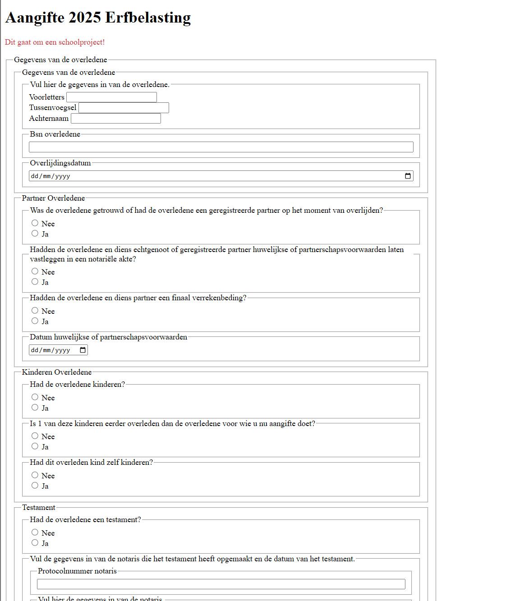

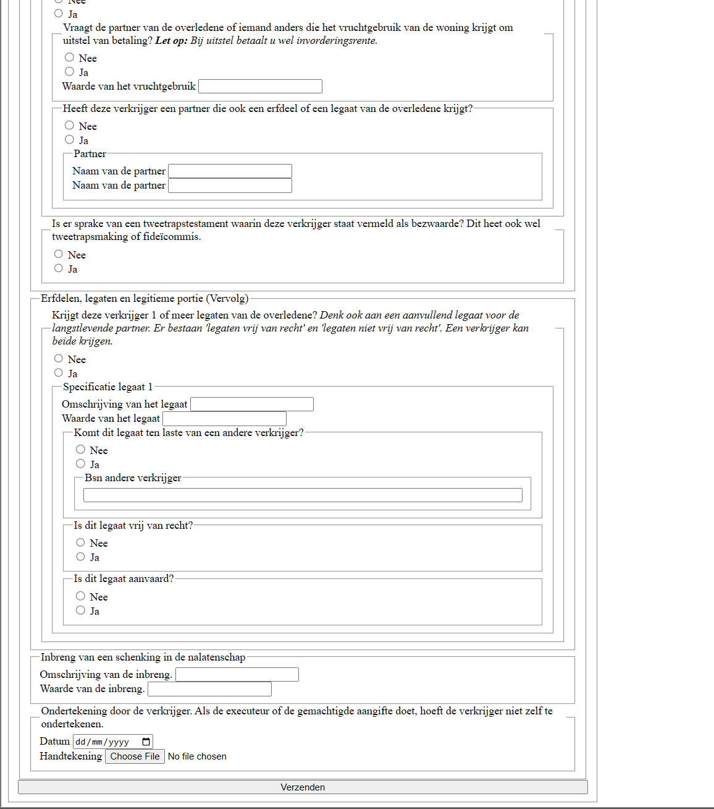

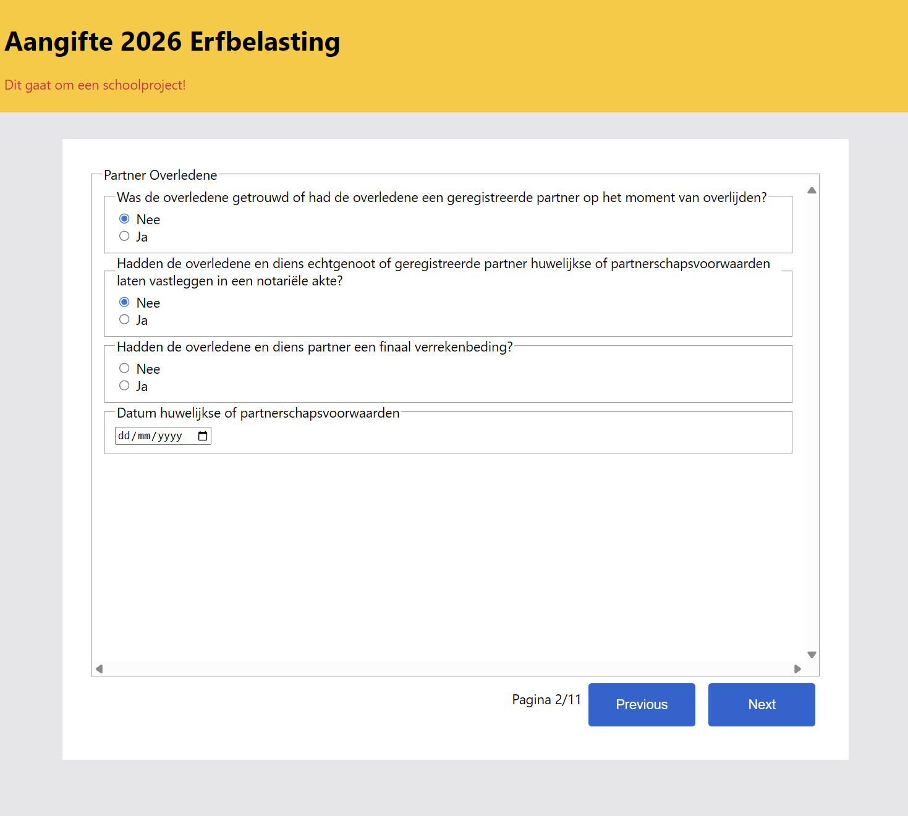

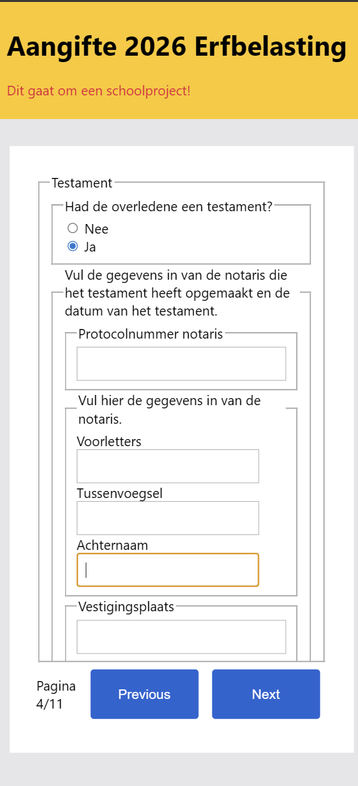

Gesprek met groepje + Vasilis
Voorbeeld Pattern = Je klikt op nee en er komen een paar vragen uit

Inert in cSS
niet mee kunnen interacteren
CSS: interactivity:inert;

Door gaan naar volgende pagina zou KUNNEN met css-only

Als JS niet werkt, moet het ook kunnen werken (default tabs zichtbaar maken)

Fieldset zonder legens is geen fieldset, doe dan maar div

Matthew had knoppen voor zijn radio buttons (knoppen met tekst erin)

je kan input[type="text"] gebruiken 

https://tractie.ns.nl/2e23992f3/p/226ce1-tractie--ns-design-system

## Dag 3 (2 maart)
### Werkzaamheden
We zijn vandaag begonnen met wat uitleg over validatie. Ik heb er wat van opgestoken. Ik deel mijn formulier op in verschillende tabs. Ik heb met JavaScript geprogrammeerd dat het de huidige tab (het fieldset die nu zichtbaar is) gevalideerd wordt wanneer je naar de volgende pagina gaat. Ik vond alleen wel dat het irritant is dat je alles MOET invullen  voordat je naar de rest kan kijken. Ik heb een popup toegevoegd waarin de gebruiker te weten komt dat niet alles correct is ingevuld maar wel door mag naar de volgende vraag.

Verder heb ik vandaag de feedback van de vrijdag voor het reces toegepast over Progressive Enhancement. Alle tabs zijn nu standaard zichtbaar en krijgen nu een  .inactive class als ze niet de huidige tab zijn. Als je de pagina nu bekijkt zonder JavaScript zou je nog steeds alle vragen kunnen invullen. Helaas is het nog niet perfect want je kan nog maar voor 1 erfgename invullen. Misschien moet ik het standaard 4 maken? Daarnaast hebben alle tabs een standaard grootte waardoor je in elke individuele tab moet scrollen.

Daarnaast heb ik wat extra tabs toegevoegd om de gebruiker te informeren. Op het begin staat een introductie, als je dan op volgende drukt kun je beginnen met invullen. Daarnaast heb ik halverwege nog een tab. Daar kun je het aantal erfgenamen invullen. Momenteel is het een number input met een knop om de formulieren te generenen. Dit kan nog wel beter. Ik ga dit mengen met de Volgende knop. Daarnaast ga ik er waarschijnlijk +/- knoppen van maken.

Ik was lang bezig met het laten genereren van nieuwe fieldsets in de form. Wat ik uiteindelijk heb gedaan is een <template> om alle fieldsets heen zetten die meerdere keren worden ingevuld. Toen dit eenmaal werkte heb ik aan het einde van het formulier een bedank tabje toegevoegd en daarna zie je een overzicht van de namen van de overledene en de erfgenamen.

### Weekly Geek 2 - UX van HTML
Om 15.00 ben ik nog bezig geweest met de Weekly Geek. We moeten artikelen lezen over html attributen maken met alleen divs, CSS en JS. Ik zit in groepje 5 en houd me bezig met de checkbox en de radiobutton + bijbehorende labels. Ik heb me in wat bronnen verdiept. 

The Checkbox Role
https://developer.mozilla.org/en-US/docs/Web/Accessibility/ARIA/Reference/Roles/checkbox_role
Dit artikel gaat over checkboxes maken met een span. Met HTML maak je een [] en stel je aria-checked in. Met CSS vul je een gecheckte versie [x] en een lege versie []in en maak je een focus state. Vervolgens met JavaScript zorg je er met spatie voor dat aria-checked op true/false gezet wordt.

The Radio Role
https://developer.mozilla.org/en-US/docs/Web/Accessibility/ARIA/Reference/Roles/radio_role
Het principe voor radios is in principe hetzelfde als voor de checkboxes maar iets complexer. Met radio buttons kun je maar 1 van X aantal selecteren. Verder kun je ze met de pijltoetsen bedienen. 

input type="checkbox"
https://developer.mozilla.org/en-US/docs/Web/HTML/Reference/Elements/input/checkbox
Dit artikel gaat over de standaard checkboxes in de form inputs. Deze kun je activeren en deactiveren. De value van een checkbox is altijd on/off. Als je meerdere checkboxes hebt met je er wel voor zorgen dat ze allemaal een andere ID hebben. Verder moeten ze allemaal een label hebben en worden ze vaak gegroepeerd met fieldsets. Ook zit er default styling op van een blauwe checkmark.

input type="radio"
https://developer.mozilla.org/en-US/docs/Web/HTML/Reference/Elements/input/radio
Een radio button zit meestal in een groep met meerdere radios. Het is dan de bedoeling dat je 1 van X aantal radio buttons selecteerd. In code moeten de radios dan dezelfde naam hebben, maar wel een unieke value. De value is het antwoord van de gebruiker. Net als checkboxes hebben de radios ook een label om aan de gebruiker te laten zien waar ze voor staan.

The Label element
https://developer.mozilla.org/en-US/docs/Web/HTML/Reference/Elements/label
Labels zijn essentieel voor radio buttons en checkboxes. Zonder labels zou je niet weten waar een individuele button/checkbox over gaat. In de code kun je de buttons ook in de labels plaatsen, wat ervoor zorgt dat als je op de label klikt, de radio button ook (de)activeert. Verder staat in het artikel om links buiten de labels te houden zodat ze daar buiten kunnen interacteren. Daarnaast moet je geen headings als labels gebruiken. Losse tekst in een label is prima. Je kunt labels ook verbinden met ID, maar ik ben zelf meer een voorstander van inputs plaatsen binnen de label, dan weet je dat het goed zit.

Uiteindelijk heb ik wat ideeen opgedaan over hoe je radios/checkboxes kunt maken met HTML en JS. Je kunt met JavaScript togglen tussen de states die je nodig hebt en met HTML kun je vierkantjes of cirkeltjes maken die je met CSS kan stylen. Wel zat ik te denken: een checkbox is gewoon een boolean. In JavaScript is een boolean een element die aan/uit kan zijn (true/false). In principe zou je dit dan op HTML elementen toe kunnen passen. Dit ga ik morgen proberen.

### Checkout met Mitchell
Ik werd vabdaag gerandomized met Mitchell. Hij heeft momenteel 1 pagina met alles van onderdeel 1. Hij is vandaag bezig geweest met validatie. Wanneer je op verzenden klikt komt er een rode kleur op alle inputs die niet in orde zijn.
Verder is hij van plan om de NS Radio Panels na te maken van de NS Tractie.
Ik heb laten zien wat ik heb gedaan. Ik heb nog het probleem dat onderdeel 4 nu niet zichtbaar is wanneer ik de pagina zonder JS laadt. Verder zou je hem het liefst meerdere keren willen invullen. Hij kwam met het idee om standaard 4 erfgnamen in te stellen voor progressive enhancement, maar dat zou wel veel HTML zijn.

## Dag 4 (3 maart)
### Werkzaamheden
Vandaag begonnen we met de Weekly Geek. Ik heb met mijn clubje de radio buttons en checkboxes besproken. Verder hebben we die in codepen nagemaakt. Matthew had in zijn codepen de checkboxes nagemaakt en ik had in die van mij de radio buttons nagemaakt. Ik had eerst de code van de site gekopieerd maar die werkte niet. Uiteindelijk heb ik hem werkend gekregen met hu

Ik ben bezig geweest met wat styling. Ik heb wat tekst blauw gemaakt net als de NS en heb de radio buttons aangepast naar deze pagina.
https://tractie.ns.nl/2e23992f3/p/105872-radio-buttons

Als je op volgende knop drukt, blijf je daarop gefocust, met een screen reader zou dit lastig zijn. Ik heb in JavaScript toegevoegd dat de focus gaat naar de eerste vraag zodat je het met een screen reader zou blijven volgen zonder verdwaald te raken

Verder ben ik bezig geweest met disabled inputs. De vragen die in eerste instantie disabled zijn die pas activeren wanneer je bij een bepaalde radio button JA invoert. Dit heb ik met JavaScript gedaan met behulp van IDs.

Ook heb ik mijn code van gisteren wat opgeschoont. Nu werkt het maken van een nieuwe form per erfgename ook op de Volgende knop. Het enige wat ik nog moet toevoegen is de optie weghalen om naar de volgende pagina te gaan als je het aantal niet goed hebt ingevuld.

Ik heb vandaag veel gekloot met onderdeel 4E/4F. Hier is de eerste vraag een radio en als je JA invoert kun je de rest van de pagina doen. Verder kun je meerdere legaten hebben en voor elk legaat apart invullen. Dit is vandaag niet gelukt. Ik ben ook aan het overwegen om dit onderdeel te schrappen. Ik heb nog 2 weken dus ik ga er nog over nadenken.

### Checkout met Maja
Vandaag werd ik gerandomized met Maja
Zij heeft nog geen styling op haar website. Wel heeft ze feedback voor de gebruiker wanneer je het formulier niet goed invult. Verder heeft ze rode & groene inputs om te laten zien wanneer je iets wel of niet goed hebt ingevuld.
Bij de progressive disclosure knoppen haalt zij de inputs weg met display none en heeft ze extra code gebruikt voor required/resets.

## Week 2 Overzicht
Deze week ben ik veel bezig geweest met de logica van het formulier. Ten eerste heb ik wat tabs toegevoegd tussen de onderdelen door. Aan het begin heb je een korte introductie voordat je de eerste vraag in beeld krijgt. Je klikt op Volgende om naar de volgende pagina te gaan. Daarnaast is er een pagina aan het eind van het formulier voor een kort bedankje en een tussenpagina voor de start van onderdeel 4 waarin de gebruiker het aantal erfgenames kan invullen.

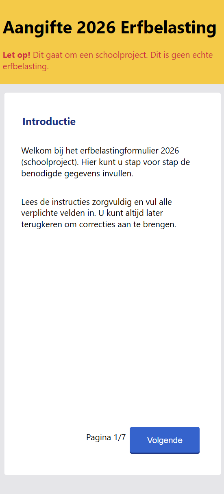
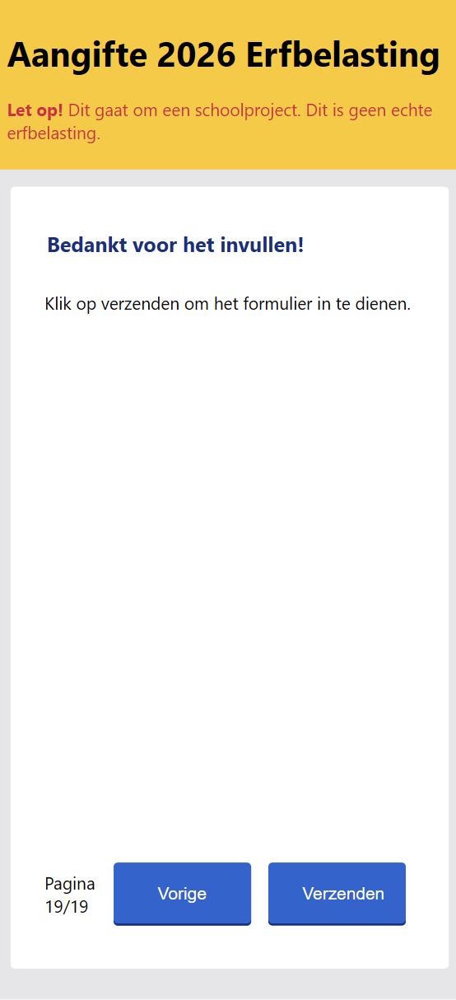

Hij is nog niet perfect maar je kunt in deze input het aantal erfgenames invoeren en voor elke erfgename komen er 7 pagina's bij (heel onderdeel 4 is per erfgename). De paginas worden pas geladen wanneer er een antwoord is gegeven. Op het moment is het minimaal 1 en maximaal 100. Voor de grap heb ik 1000 en zelfs 9999999999999 geprobeerd en mijn website was vastgelopen... De cap wordt dus 100. 

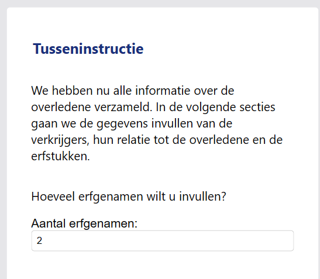

Aan het eind van het formulier zie je een popupp van de namen van de overledene en erfgenames om nog een overzicht te krijgen voor hoeveel mensen je hebt ingevuld.
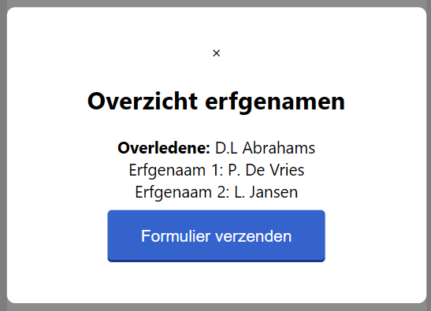

Verder zijn we deze week veel bezig geweest met validatie. Op elke pagina wordt er gevalideerd of elke vraag wel/niet goed is ingevuld en wanneer dit niet het geval is, krijg je een popup in beeld die laat weten dat nog niet alles correct is ingevuld. Wel krijg je de optie om verder te gaan om later alles te corrigeren. Ik vind dat de gebruiker wel de optie mag hebben om de rest van de vragen te lezen voordat alles perfect is ingevuld.

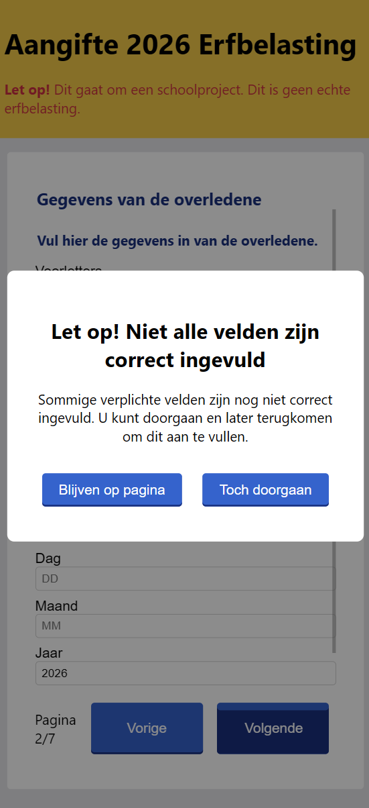

Ook heb ik disabled buttons toegepast voor de optionele vragen. Deze vragen worden pas aangezet wanneer de ze relevant worden door JA te kiezen bij een andere vraag. Ik vind het geen fijn idee om vragen onzichtbaar te maken want dan weet de gebruiker niet of ze nog belangrijk worden of wordt de gebruiker spontaan gejumpscared door meer vragen. Ik wil laten zien dat de vragen daar staan maar wel duidelijk hebben dat je ze niet per se hoeft in te vullen. Ik ga nog wat styling toepassen om dit duidelijker te maken.

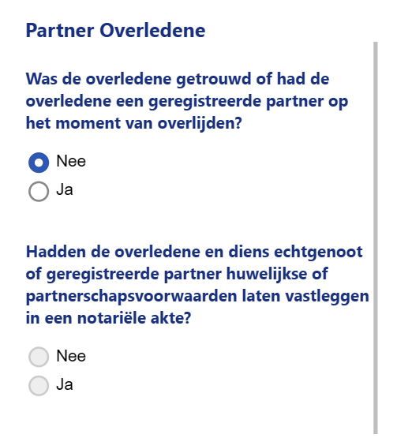

Als laatste heb ik nog iets toegepast voor screenreaders. Als je het formulier met toetsenbord alleen bedient (dus met TAB en SPACE), wanneer je bij de volgende knop komt en naar de volgende pagina gaat, heb ik logica toegevoegt dat de focus weer komt op de eerste input. Zo kun je gelijk verder zonder terug te hoeven tabben naar boven.
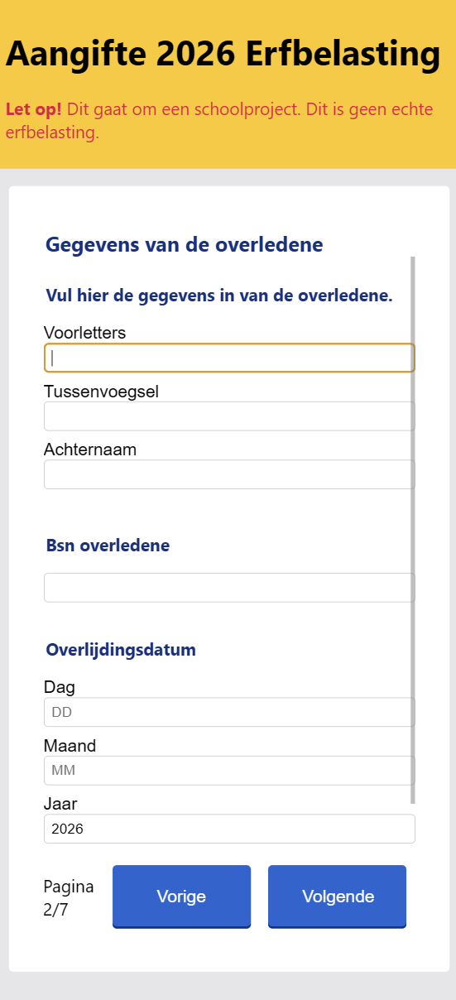

Ik ben verder nog bezig geweest met de logica implementeren voor onderdeel 4e/4f, maar omdat dit al werk is die al eerder heb gedaan en ik al veel andere logica erin heb zitten, zit ik eraan te denken om dit onderdeel te schrappen. Hier ga ik het in het groepsgesprek over hebben.

Op vrijdag heb ik het gesprek gehad met mijn clubje, hiervan wat aantekeningen:
Sela heeft de standaard error messages als tekst onder de inputs
Matthew heeft progressive disclosure volledig met CSS dmv :has()

Tips:
Doe meer focus op detail, niet meer op kwantiteit
Ik ga 4e schrappen. Ik kan me beter focussen op het verbeteren van de andere functionaliteiten.
Je kan 31 februari intikken. Dit zou niet mogelijk moeten zijn.
Disabled buttons duidelijker maken met styling.
Validatie !!!
Maak duidelijk wanneer de gebruiker iets goed/fout invult. Ik ben van plan om dit te doen per vraag. Verder wil ik extra info bij elke vraag neerzetten.

## Dag 5 (9 maart)
### Gastcollege Rijk van Zanten
Vandaag kwam een oud CMD student langs om te vertellen over zijn ervaring met CMD, wat hij daarna heeft gedaan en waar hij nu staat. Hij had wel een goed verhaal om te vertellen. Voor zijn afstudeerproject was hij naar New York gegaan en is daar gebleven tot de dag van vandaag. Wel een inspirerend verhaal.

### Werkzaamheden
Vandaag heb ik ten eerste onderdeel 4e en 4f volledig verwijdert uit mijn HTML. Die ga ik niet doen. Misschien doe ik nog hetzelfde voor bv. 4g maar voor nu laat ik het zo.

Vandaag ben ik vooral bezig geweest met validatie. Ik heb nu voor elke input (behalve de radios) een span eronder waarin tekst komt te staan wanneer je een input invult. Ik heb voor een correct ingevulde input een groene kleur om de input heen zonder extra tekst erbij en wanneer je een fout antwoord indient een rode kleur met de error message van de input. Deze zijn voor mij in het Engels want mijn laptop is in het Engels ingesteld. Verder als je met een input interacteert en niet invult krijg je de error message te zien dat je niks hebt ingevuld. Ik moet wel nog ervoor zorgen dat het ook wordt toegepast wanneer de popup in beeld komt wanneer je op Volgende klikt. 

Ik had extra code nodig om dit allemaal werkend te maken voor het tweede onderdeel per erfgename. Omdat dit onderdeel van het formulier gegenereerd wordt, is deze nog niet geladen wanneer de functie afspeelt. Ik heb dus in de functie waarin dit gegenereerd wordt ook de validatie functie opgeroepen.

Daarnaast kun je nu niet meer naar de volgende pagina voordat je het aantal erfgenames hebt ingevuld. 

### Weekly Geek #3 - What happened to text inputs

Voor deze weekly geek moeten we een video kijken. Deze video heeft ook een transcript op de website en gaat over text inputs

Wolf 1 - De Web gebruiker, wil graag duidelijk en simpel
Wolf 2 - De Web designer, wil nieuwe dingen uitproberen

Vormen van Signification - bv. Hyperlinks hebben een streep eronder

Wat zijn er gebeurd met text inputs, ze zijn nu alleen maar een onderkant ipv een box. Het is nu eerder een "onput"
Als er een label boven zit, is het niet eens duidelijk dat deze erbij hoort.

Ipv terug gaan naar het goede oude methode, gaat hij verder met de nieuwe slechte methode om er creatief mee om te gaan
> De labels zijn nu placeholders die in de input staan

Om de placeholders zichtbaar te maken heeft hij ze wit gemaakt waardoor ze nu lijken op values...

Double double down > De placeholder gaat omhoog zodat deze niet verwijderd wordt.

Nu zijn er 3 soorten inputs en de oudste is de enige goede

Het punt is dat er nieuwe designs worden gemaakt voor elementen die geen nieuwe design nodig hebben. Ik snap beide kanten wel. Uiteraard als gebruiker wil je liever geen verandering, vooral als er niks verkeerd was aan het oude ontwerp maar ik snap ook dat de designer meerdere ontwerpen wil uitproberen voor een product.

### Checkout met Jacco & Aya
Ik werd vandaag gerandomized met Choice, maar zij was niet aanwezig. Ik werd ingedeeld met Jacco. Aya had ook geen duo dus zij had zich ook bij ons toegevoegd
Ik liet zien dat ik bezig was met validatie vandaag en dat ik morgen bezig wil zijn met met de rest van de logica.
Aya eerst alles in 1 fieldset, nu opgedeeld. Vragen die zichtbaar worden

## Dag 6 (10 maart)
Vandaag waren begonnen met de Weekly Geek. We hadden een wooclap over de video.

Geen validatie op radio buttons

## Bronnenlijst

NS Tractie - 
Link: https://tractie.ns.nl/2e23992f3/p/226ce1-tractie--ns-design-system

Mozilla Patterns - 
Link: https://developer.mozilla.org/en-US/docs/Web/HTML/Reference/Attributes/pattern

W3Schools - 
Link: https://www.w3schools.com/howto/howto_js_form_steps.asp

The Checkbox Role -
https://developer.mozilla.org/en-US/docs/Web/Accessibility/ARIA/Reference/Roles/checkbox_role

The Radio Role - 
https://developer.mozilla.org/en-US/docs/Web/Accessibility/ARIA/Reference/Roles/radio_role

input type="checkbox" -
https://developer.mozilla.org/en-US/docs/Web/HTML/Reference/Elements/input/checkbox

input type="radio" -
https://developer.mozilla.org/en-US/docs/Web/HTML/Reference/Elements/input/radio

The Label element
https://developer.mozilla.org/en-US/docs/Web/HTML/Reference/Elements/label

What happened to text inputs?
https://briefs.video/videos/what-happened-to-text-inputs/